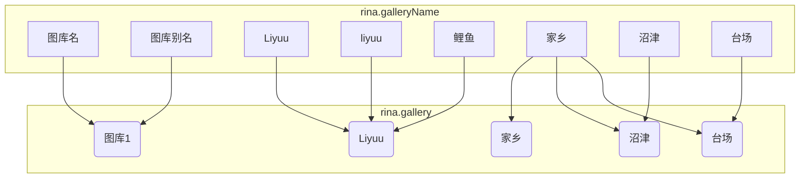

<h1>koishi-plugin-rinachanbot</h1>

基于<a href="https://github.com/koishijs/koishi">koishi</a>,为财拉会开发的群璃奈bot,随缘更新功能中

## 📕 指令一览

在下文的指令介绍中指令均采用以下格式:`/指令名 <必需参数> [可选参数] ... -选项1 <选项1必需参数> [选项1可选参数] -选项2 ...`,之后不再赘述.部分指令暂时未继承到本项目中,会在

#### 🖥️ 测试

- `/天使天才`: 简单的测试指令测试bot是否还活着,如果活着应当会回复**天王寺！[≧▽≦]**.

#### 🔍 信息查询

- `/生日 [月份]`: 查询指定月份LL企划的生日信息.
    - `[月份]`-接受一个合法的月份数字输入.输入非数字时抛出错误,缺省或输入不合法数字时默认使用当前月份.
    - **使用举例**
        - 查询本月生日信息:`/生日`
        - 查询8月生日信息:`/生日 8`
- `/日程 [日期] [月份] [年份]`: 从[ラブライブ！カレンダー | LL-Fans](https://ll-fans.jp/articles/calendar)订阅的谷歌日历拉取对应的日程信息.
    - `[日期] [月份] [年份]`-接受一个合法的数字输入.输入非数字时抛出错误,缺省时默认采用当前时间的值,输入不合法的数字时会自动偏移修正(例如查询`/日程 31 6 2024`时会实际返回2024年7月1日的日程信息).
    - **使用举例**
        - 查询今日日程:`/日程`
        - 查询今年6月30日日程:`/日程 30 6`(缺省年)
- `/twitter`系列指令(由[koishi-plugin-kbot](https://github.com/Kabuda-czh/koishi-plugin-kbot)提供功能支持)
    - `/twitter -s <推特id>`-拉取指定推特id的最新一条推特.
    - `/twitter -a <推特id>`-在本群订阅指定推特id的推特
    - `/twitter -r <推特id>`-移除指定推特id在本群的订阅
    - `/twitter -l`-查看本群订阅列表

#### 🖼️ 图库

本插件中图库管理逻辑如下(举例):

允许将多个图库别名关联到同一个图库,也允许一个图库名关联多个图库.本插件的图库目录在[财拉会活动室](https://llsif.738ngx.site/)官网上可查(有密码,仅限群侑访问).

- `/新建图库 <图库名> [...rest]`: 新建一个或多个图库.
    - `<图库名>`-接受一个字符串输入并作为新图库的名称.建议使用标识性较高不容易造成混淆和歧义的名字作为图库名(比如人名全名).
    - `[...rest]`-接受多个用空格隔开的字符串输入作为图库名称
    - **使用举例**
        - 创建单个图库:`/新建图库 Liyuu`
        - 创建多个图库:`/新建图库 秋叶原 沼津 台场 原宿 金泽`.
- `/关联图库 <图库名> <已有图库名> -f`: 关联一个新图库别名到已有图库.
    - `<图库名>`-接受一个字符串输入作为关联的新图库别名,如果已经添加过该别名会抛出错误.
        - 实际上允许存在一个别名关联到多个,只不过需要启用`-f`选项.
    - `<已有图库名>`-接受一个字符串输入作为被关联的图库名,如果在已知的图库名和别名中不存在该输入,会抛出错误.
        - 未启用`-f`选项时,该参数支持图库别名的映射.例如:`/关联图库 努玛梓 numazu`.
        - 启用`-f`选项时,该参数不支持图库别名的映射.例如:`/关联图库 家乡 numazu -f`不可行,必须`/关联图库 家乡 沼津 -f`.
    - `-f`-启用该选项后,允许强行将重名的图库名关联到图库.如果`<图库名>`并非重名项,会抛出错误.
    - **使用举例**
        - 普通使用:`/关联图库 鲤鱼 Liyuu`
        - 已存在*家乡*别名的情况下继续关联:`/关联图库 家乡 沼津 -f`.
- `/加图 <图库名> [图片名] -e <图片格式>`:保存图片到指定图库
    - `<图库名>`-接受一个字符串输入,加入的图片将会保存到该输入图库名对应的图库路径.如果图库名不存在,抛出错误.
        - 
        - 在本条指令中一个图库名映射多个图库的映射关系不可用,图片只会保存到这个图库名初次添加时的对应图库.
    - `[图库名]`-接受一个字符串输入作为图片的文件名,如果缺省时自动按照文件的上传时间命名,如果重名会自动为文件名加上序号后保存.
    - `-e <图片格式>`-接受一个合法的图片扩展名(目前仅支持jpg,png,gif)输入,图片文件将以该扩展名指定的格式保存.输入非法的扩展名会修正为设置的默认扩展名.
    - **使用举例**
        - 不加任何参数:`/加图 鲤鱼`
        - 将图片保存为gif格式:`/加图 花丸 -e gif`
        - 将图片保存为*彩虹大桥.png*:`/加图 台场 彩虹大桥 -e png`
- `/璃奈板 <图库名> [数量] -r`
    - `<图库名>`-接受一个字符串输入,随机从该图库名对应的图库路径中选择图片输出.如果图库名不存在,抛出错误.
        - 在本条指令中
    - `[数量]`-接受一个数字输入,输出数字指定的图片数量.缺省时默认输出1张,超过设置输出上限(默认10)时按照上限值输出.
    - `-r`:不启用该选项时,出图逻辑为输出图库路径下随机位置开始的连续指定数量张图片(性能开销较小);启用该选项后,出图逻辑为输出路径下任意次序的指定数量张图片(性能开销较大,尤其是当图库下图片数量较多时).
    - **使用举例**
        - 不加任何参数,输出1张图片:`/璃奈板 鲤鱼`
        - 乱序输出10张图片:`/璃奈板 花丸 10 -r`

#### 🎲 互动

- `/塔罗`: 抽1张塔罗牌并进行占卜.
- `/塔罗牌`: 抽1组4张塔罗牌并进行占卜.
- `/点歌 <歌名>`:从QQ音乐和网易云检索音乐并通过语音形式返回(由[koishi-plugin-music-downloadvoice-api](https://github.com/idranme/koishi-plugin-music-downloadvoice-api)提供功能支持)
    - `<歌名>`-接受一个字符串输入,歌名含有空格时请为歌名加上半角括号
    - **使用举例**
        - 歌名不含空格:`/点歌 虹咲校歌`
        - 歌名含空格:`/点歌 (neo sky neo map)`

- `/发病 <发病对象>`:输出一段随机的发病文字.(由[koishi-plugin-lunatic](https://www.npmjs.com/package/koishi-plugin-lunatic/v/1.1.0)提供功能支持)

## 📝 更新日志

- **1.1.0**
    - 整体文件结构整理,文档和许可证完善.
    - 整合了图库功能,原`rinachanbot-img-manager`项目废弃,不再维护.
        - 为`/关联图库`指令增加了重名情况下的`-f`强制关联选项.
        - 为`/加图`指令的`-e <图片格式>`增加了范围限制.
        - 调整了单次加入多张图片时的消息输出数量.
        - 调整了`/璃奈板`指令的出图选项,现在需要使用`-r`选项来设置所有图片乱序输出.
- **1.0.5**
    - 增加了塔罗牌占卜功能.
    - 引用插件功能:推特订阅与拉取.
    - 引用插件功能:发病.
    - 对从一个图库名查询多个图库的场景进行了性能优化.
- **1.0.4**
    - 为`/生日`指令增加了月份参数.缺省时现在只会显示本月的生日信息.
    - 现在支持从一个图库名查询多个图库.
- **1.0.3**
    - 修复了`/日程`指令全天日程被归到上一天的bug.
    - 修复了批量加图时数据库不能正常更新的bug.
- **1.0.2**
    - 修复了`/日程`指令实际返回日期比输入日期提前一天的bug.修复了输出时区为UTC+0的bug.(现在为UTC+8).
    - 增加了批量增加图库的功能.
- **1.0.1**
    - 初次更新.